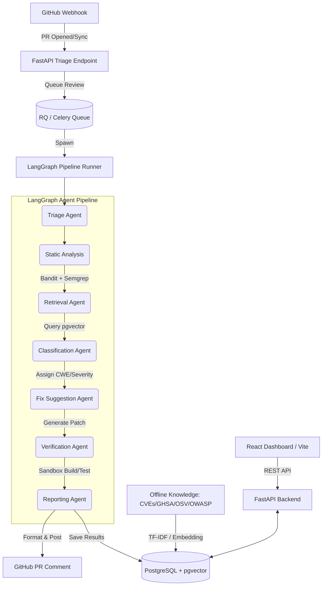

# System Architecture

SentinelReview is built around a powerful, graph-based agent architecture designed to automatically identify, categorize, and propose validated patches for vulnerabilities found in GitHub Pull Requests.

## High-Level Architecture Diagram

## Component Breakdown

### 1. Webhook & API Layer (FastAPI)
The entry point for the system. Handles HMAC-verified GitHub webhooks, triggers the review pipeline asynchronously, and serves the REST API for the React dashboard.

### 2. The Multi-Agent Pipeline (LangGraph)
The core logic is modeled as a state machine:
- **Triage**: Determines if the PR is safe to analyze or if it modifies sensitive infrastructure.
- **Static Analysis**: Runs isolated subprocesses for `bandit` and `semgrep` on the PR diff to locate raw vulnerabilities.
- **Retrieval (RAG)**: Queries the database (TF-IDF currently, pgvector ready) to pull context on the specific vulnerabilities found.
- **Classification**: Uses a Zero-Shot classifier to accurately assign OWASP/CWE labels based on the retrieved context and raw code.
- **Fix Suggestion**: Uses a generation LLM to write a targeted diff resolving the vulnerability without breaking functionality.
- **Verification**: Applies the patch in a secure, isolated sandbox, builds the codebase, and runs tests to ensure the fix actually works.
- **Reporting**: Compiles the final security report, logs it to the database, and posts it to the GitHub PR.

### 3. Data & Knowledge Tier
- **Relational DB (PostgreSQL)**: Stores all system state including users, repositories, PRs, full agent observability logs (`AgentRun`), and verification results.
- **Vector Index (pgvector/TF-IDF)**: Hosts the ingested security knowledge base (NVD, OSV, GHSA).

### 4. User Interface (React/Vite)
A modern dashboard (styled with Tailwind/CSS) providing full observability into pipeline runs, latency, costs, and historical vulnerability metrics.
