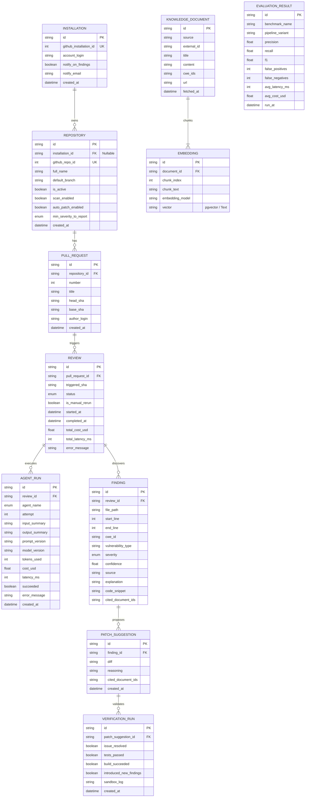

# SentinelReview ER Diagram

This diagram maps the relational database schema implemented in `backend/app/db/models.py`.

```mermaid
erDiagram
    INSTALLATION {
        string id PK
        int github_installation_id UK
        string account_login
        boolean notify_on_findings
        string notify_email
        datetime created_at
    }

    REPOSITORY {
        string id PK
        string installation_id FK "Nullable"
        int github_repo_id UK
        string full_name
        string default_branch
        boolean is_active
        boolean scan_enabled
        boolean auto_patch_enabled
        enum min_severity_to_report
        datetime created_at
    }

    PULL_REQUEST {
        string id PK
        string repository_id FK
        int number
        string title
        string head_sha
        string base_sha
        string author_login
        datetime created_at
    }

    REVIEW {
        string id PK
        string pull_request_id FK
        string triggered_sha
        enum status
        boolean is_manual_rerun
        datetime started_at
        datetime completed_at
        float total_cost_usd
        int total_latency_ms
        string error_message
    }

    AGENT_RUN {
        string id PK
        string review_id FK
        enum agent_name
        int attempt
        string input_summary
        string output_summary
        string prompt_version
        string model_version
        int tokens_used
        float cost_usd
        int latency_ms
        boolean succeeded
        string error_message
        datetime created_at
    }

    FINDING {
        string id PK
        string review_id FK
        string file_path
        int start_line
        int end_line
        string cwe_id
        string vulnerability_type
        enum severity
        float confidence
        string source
        string explanation
        string code_snippet
        string cited_document_ids
    }

    PATCH_SUGGESTION {
        string id PK
        string finding_id FK
        string diff
        string reasoning
        string cited_document_ids
        datetime created_at
    }

    VERIFICATION_RUN {
        string id PK
        string patch_suggestion_id FK
        boolean issue_resolved
        boolean tests_passed
        boolean build_succeeded
        boolean introduced_new_findings
        string sandbox_log
        datetime created_at
    }

    KNOWLEDGE_DOCUMENT {
        string id PK
        string source
        string external_id
        string title
        string content
        string cwe_ids
        string url
        datetime fetched_at
    }

    EMBEDDING {
        string id PK
        string document_id FK
        int chunk_index
        string chunk_text
        string embedding_model
        string vector "pgvector / Text"
    }

    EVALUATION_RESULT {
        string id PK
        string benchmark_name
        string pipeline_variant
        float precision
        float recall
        float f1
        int false_positives
        int false_negatives
        int avg_latency_ms
        float avg_cost_usd
        datetime run_at
    }

    %% Relationships
    INSTALLATION ||--o{ REPOSITORY : "owns"
    REPOSITORY ||--o{ PULL_REQUEST : "has"
    PULL_REQUEST ||--o{ REVIEW : "triggers"
    REVIEW ||--o{ AGENT_RUN : "executes"
    REVIEW ||--o{ FINDING : "discovers"
    FINDING ||--o{ PATCH_SUGGESTION : "proposes"
    PATCH_SUGGESTION ||--o{ VERIFICATION_RUN : "validates"
    KNOWLEDGE_DOCUMENT ||--|{ EMBEDDING : "chunks"
```
